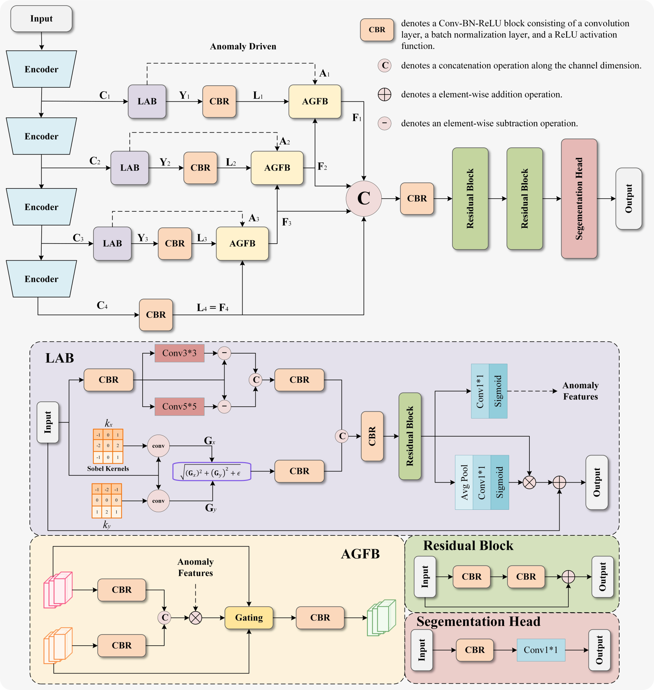
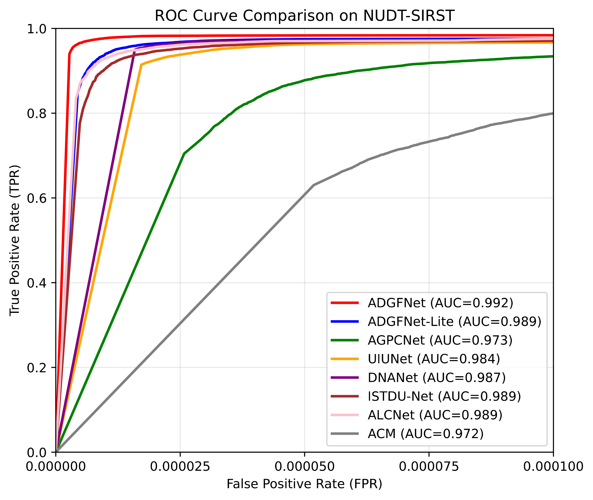
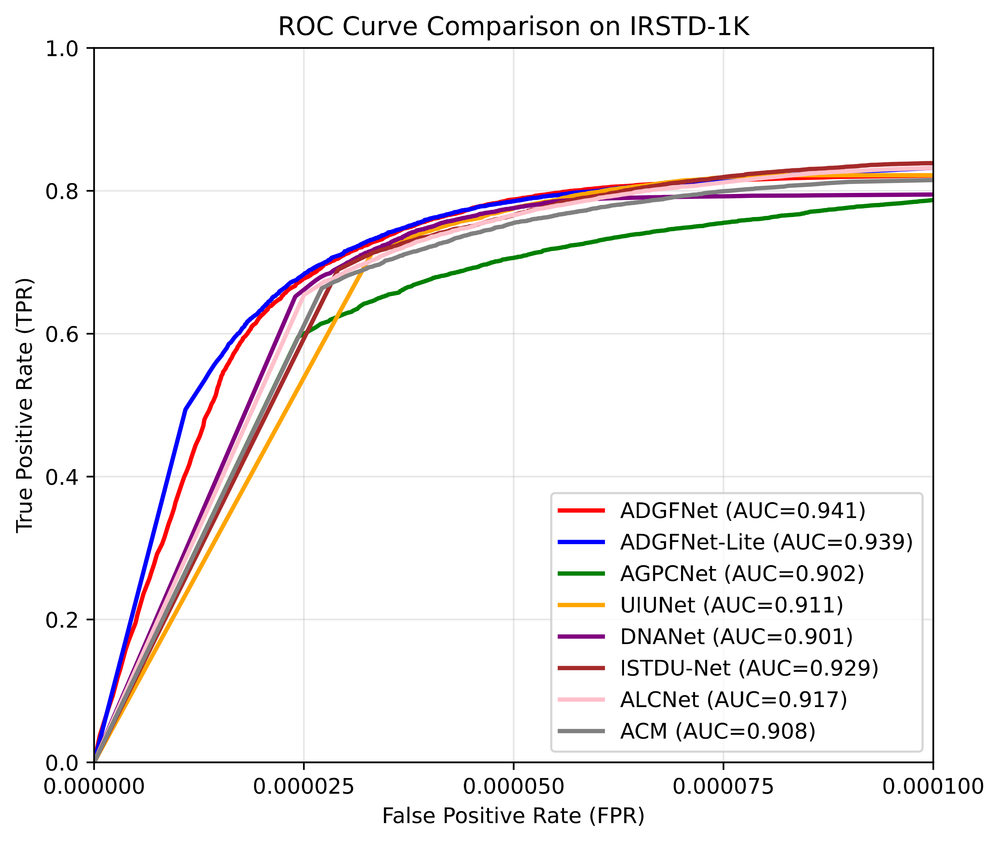
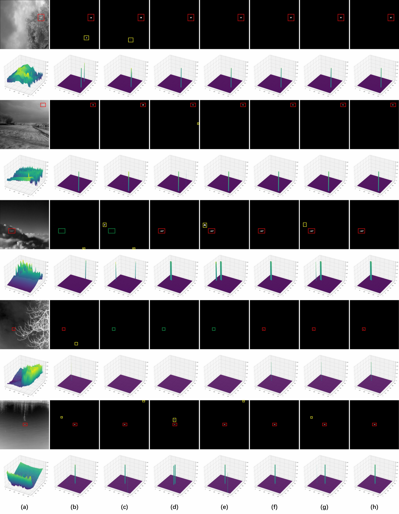
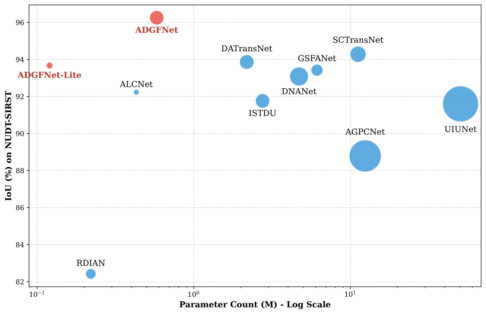
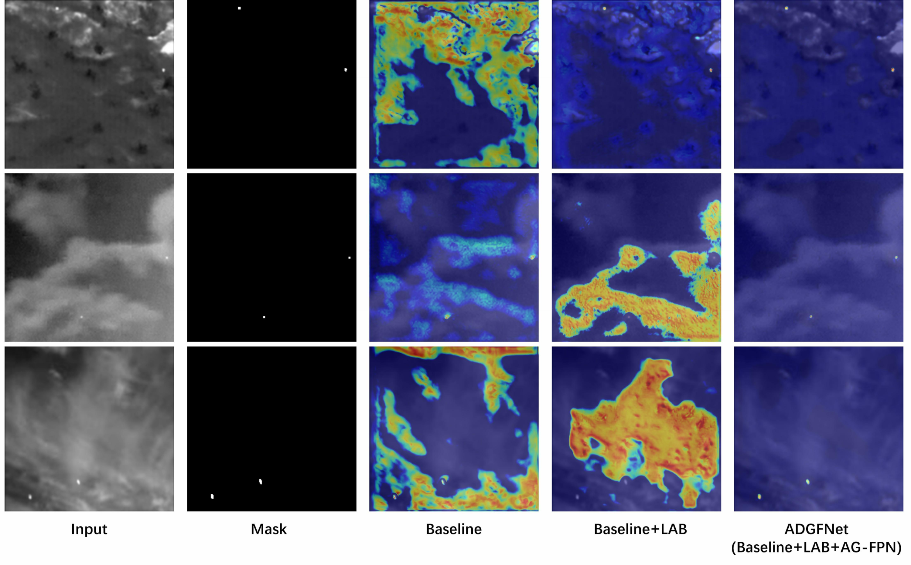

<div align="center">

# ADGFNet

### Anomaly-Driven Gated Fusion Network for Infrared Small Target Detection

[](#adgfnet)
[](#-overview)
[](#-quantitative-results)
[](LICENSE)
[](https://doi.org/10.5281/zenodo.21359994)

**A lightweight, physics-prior-guided framework for accurate infrared small target detection.**

[Overview](#-overview) · [Architecture](#-architecture) · [Quick Start](#-quick-start) · [Results](#-quantitative-results) · [Roadmap](#-roadmap) · [Citation](#-citation)

</div>

> [!IMPORTANT]
> The official implementation is now available. Datasets and pretrained weights are hosted separately to keep this repository lightweight.

## 🔍 Overview

ADGFNet is a lightweight end-to-end framework that explicitly embeds infrared-specific physical priors into feature extraction and cross-scale fusion. It achieves strong infrared small target detection performance with only **0.58M parameters**. The deployment-oriented **ADGFNet-Lite** uses only **0.12M parameters and 0.89G FLOPs**.

## ✨ Highlights

- **Local Anomaly Block (LAB):** combines a Local Contrast Branch for multi-scale intensity saliency with a Gradient Prior Branch using fixed, parameter-free Sobel operators.
- **Anomaly-Guided Feature Pyramid Neck (AG-FPN):** reuses LAB anomaly maps as spatial gates for selective cross-scale feature fusion without introducing an additional learnable spatial-attention module.
- **Composite segmentation loss:** combines pixel-level BCE, region-level SoftIoU, and Structure Consistency supervision.
- **High parameter efficiency:** ADGFNet reaches 96.25% IoU on NUDT-SIRST with only 0.58M parameters.

## 🏗️ Architecture



ADGFNet employs a four-stage lightweight residual encoder. LAB modules enhance the first three stages and produce anomaly-aware features together with single-channel anomaly maps. AG-FPN reuses these anomaly maps to guide top-down feature fusion. A residual refinement module and segmentation head generate the final prediction. ADGFNet-Lite narrows the encoder and neck channels and removes the refinement module for resource-constrained deployment.


| Model            | LAB |  Neck  | Refinement | Parameters | FLOPs at 256 × 256 |
| :----------------- | :---: | :------: | :----------: | -----------: | --------------------: |
| **ADGFNet**      | Yes | AG-FPN |    Yes    |      0.58M |               7.88G |
| **ADGFNet-Lite** | Yes | AG-FPN |     No     |      0.12M |               0.89G |

## 🚀 Quick Start

### 1. Installation

Clone the repository and enter the implementation directory:

```bash
git clone <repository-url>
cd ADGFNet-public/ADGFNet
```

Create a Python environment and install the required packages:

```bash
conda create -n adgfnet python=3.9 -y
conda activate adgfnet
pip install torch torchvision numpy matplotlib opencv-python scikit-image pillow
```

> Please select the PyTorch build compatible with your CUDA version from the official PyTorch installation guide.

### 2. Datasets and Pretrained Weights

Download the prepared datasets and pretrained checkpoints from **[Quark Drive](https://pan.quark.cn/s/844804935be8?pwd=ZS8u)** (access code: `ZS8u`), then place the extracted files under `ADGFNet/` using the following layout:

```text
ADGFNet/
├── checkpoints/
│   ├── IRSTD-1K/
│   │   ├── ADGFNet.pth.tar
│   │   └── ADGFNetLite.pth.tar
│   └── NUDT-SIRST/
│       ├── ADGFNet.pth.tar
│       └── ADGFNetLite.pth.tar
└── datasets/
    ├── IRSTD-1K/
    │   ├── images/
    │   ├── masks/
    │   └── img_idx/
    └── NUDT-SIRST/
        ├── images/
        ├── masks/
        └── img_idx/
```

Dataset images, masks, and model weights are intentionally excluded from Git. The required directory structure and dataset split files are retained in the repository.

### 3. Training

Run the commands from the `ADGFNet/` directory. For example:

```bash
# Train ADGFNet on NUDT-SIRST
python train.py --model_names ADGFNet --dataset_names NUDT-SIRST --save ./log

# Train ADGFNet-Lite on IRSTD-1K with automatic mixed precision
python train.py --model_names ADGFNetLite --dataset_names IRSTD-1K --save ./log --amp
```

Use `--device cpu` for CPU execution or `--device cuda` to explicitly select CUDA. Training on a GPU is recommended.

### 4. Evaluation

Two evaluation modes are provided. **We recommend `test_all.py` to reproduce all results with a single command.**

| Script | Use case | Coverage |
|:--|:--|:--|
| **`test_all.py`** ⭐ | Complete evaluation (recommended) | 2 models × 2 datasets |
| `test.py` | Targeted evaluation | 1 model × 1 dataset |

#### Evaluate all pretrained models (Recommended)

> **Recommended:** Run this command to automatically evaluate **ADGFNet** and **ADGFNet-Lite** on both **NUDT-SIRST** and **IRSTD-1K**, producing all reported metrics at once.

Place all four pretrained checkpoints according to the [expected directory layout](#2-datasets-and-pretrained-weights), then run:

```bash
python test_all.py
```

For every model–dataset pair, the script reports:

```text
Pixel Accuracy · mIoU · nIoU · F-score · Pd · Fa
```

A timestamped summary is saved automatically to:

```text
checkpoints/test_<timestamp>.txt
```

<details>
<summary><b>Custom evaluation options</b></summary>

Use the following options to customize the dataset root, output directory, threshold, or batch size:

```bash
python test_all.py \
  --dataset_dir ./datasets \
  --save_log ./checkpoints/ \
  --threshold 0.5 \
  --batch_size 1
```

</details>

#### Evaluate a single model

Use `test.py` when evaluating only one specific model–dataset pair:

```bash
# Evaluate ADGFNet on NUDT-SIRST
python test.py \
  --model_name ADGFNet \
  --dataset_names NUDT-SIRST \
  --dataset_dir ./datasets \
  --weight_path ./checkpoints/NUDT-SIRST/ADGFNet.pth.tar

# Evaluate ADGFNet-Lite on IRSTD-1K
python test.py \
  --model_name ADGFNetLite \
  --dataset_names IRSTD-1K \
  --dataset_dir ./datasets \
  --weight_path ./checkpoints/IRSTD-1K/ADGFNetLite.pth.tar
```

## 📊 Quantitative Results

The following measurements are taken from the submitted manuscript. FLOPs and latency are measured at the evaluation resolution of each dataset. Fa is reported in units of 10⁻⁶.

### NUDT-SIRST


| Method           | Params (M) | FLOPs (G) | Latency (ms) |   IoU (%) |  nIoU (%) |    F1 (%) |    Pd (%) |       Fa |
| :----------------- | -----------: | ----------: | -------------: | ----------: | ----------: | ----------: | ----------: | ---------: |
| ACM              |       0.40 |      0.40 |         2.94 |     70.65 |     73.34 |     82.79 |     97.56 |    20.27 |
| ALCNet           |       0.43 |  **0.38** |     **2.75** |     92.23 |     92.35 |     95.97 |     97.88 |     6.20 |
| DNANet           |       4.70 |     14.26 |        26.50 |     93.08 |     94.39 |     96.41 |     99.15 |     9.08 |
| SCTransNet       |      11.19 |     10.12 |        32.50 |     94.28 |     94.54 |     97.06 | **99.37** |     3.49 |
| **ADGFNet**      |       0.58 |      7.88 |         5.28 | **96.25** | **95.94** | **98.09** |     99.15 | **2.34** |
| **ADGFNet-Lite** |   **0.12** |      0.89 |         3.97 |     93.67 |     93.47 |     96.72 |     99.05 |     4.76 |

### IRSTD-1K


| Method           | Params (M) | FLOPs (G) | Latency (ms) |   IoU (%) |  nIoU (%) |    F1 (%) | Pd (%) |       Fa |
| :----------------- | -----------: | ----------: | -------------: | ----------: | ----------: | ----------: | -------: | ---------: |
| ACM              |       0.40 |      1.61 |         2.89 |     63.87 |     61.52 |     77.95 |  88.88 |    10.68 |
| ALCNet           |       0.43 |  **1.51** |     **2.73** |     64.94 |     63.19 |     78.75 |  88.55 |    21.26 |
| AGPCNet          |      12.43 |    173.02 |        46.30 | **67.73** |     65.94 |     79.85 |  93.28 |    14.52 |
| SCTransNet       |      11.19 |     40.46 |        60.36 |     66.58 |     66.51 | **80.38** |  93.27 |    22.17 |
| **ADGFNet**      |       0.58 |     31.53 |        16.13 |     66.70 | **67.20** |     80.02 |  90.23 | **8.56** |
| **ADGFNet-Lite** |   **0.12** |      3.58 |         7.42 |     66.45 |     67.07 |     79.84 |  89.23 |     9.72 |

## 📈 ROC Curves

ADGFNet obtains AUCs of **0.992** on NUDT-SIRST and **0.941** on IRSTD-1K.


|                      NUDT-SIRST                      |                     IRSTD-1K                     |
| :-----------------------------------------------------: | :-------------------------------------------------: |
|  |  |

## 🖼️ Qualitative Results



## ⚖️ Accuracy–Efficiency Trade-off



## 🔥 Grad-CAM Analysis



## 🗺️ Roadmap

- [X]  Release the ADGFNet project page
- [X]  Release the network architecture and experimental results
- [X]  Release qualitative comparisons and Grad-CAM analysis
- [X]  Release the training and evaluation code
- [X]  Release dataset preparation instructions
- [X]  Release pretrained ADGFNet and ADGFNet-Lite models
- [X]  Add reproducible evaluation examples
- [ ]  Add single-image inference and visualization scripts

## 📦 Code and Pretrained Models

The training and evaluation code is located in [`ADGFNet/`](ADGFNet/). Prepared datasets and pretrained weights for ADGFNet and ADGFNet-Lite are available from **[Quark Drive](https://pan.quark.cn/s/844804935be8?pwd=ZS8u)** (access code: `ZS8u`).

## 🤝 Acknowledgements

The comparison-method implementations were adapted from the excellent [BasicIRSTD benchmark by XinyiYing](https://github.com/XinyiYing/BasicIRSTD). We independently retrained the comparison networks under the experimental protocol described in our paper and report the resulting measurements rather than copying results from the upstream repository. We sincerely thank the BasicIRSTD authors and the authors of all compared methods for making their work publicly available.

## 📝 Citation

The formal citation will be added once the paper is accepted and publication metadata becomes available.

```bibtex
@article{han2026adgfnet,
  title   = {Anomaly-Driven Gated Fusion Network for Infrared Small Target Detection},
  author  = {Han, Yeteng and Li, Jie and Liu, Zheng and Huang, Xiayang and Jia, Chaoxian and Cui, Wennan and Zhang, Tao},
  year    = {2026}
}
```

## 📄 License

This project is released under the [MIT License](LICENSE).
